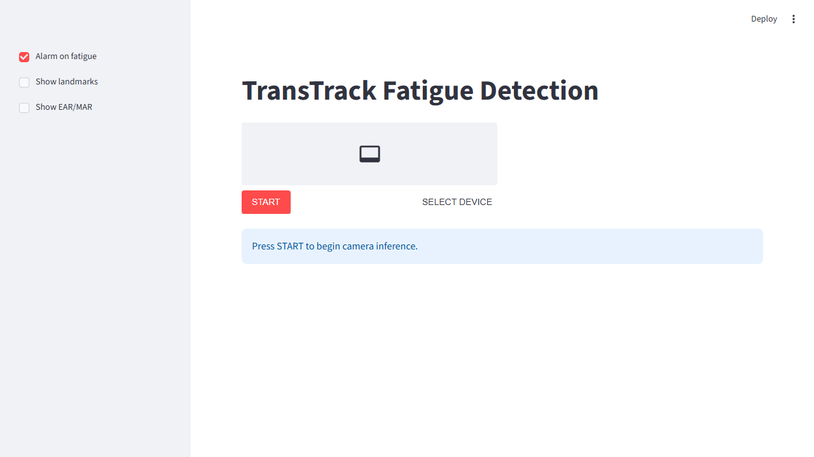
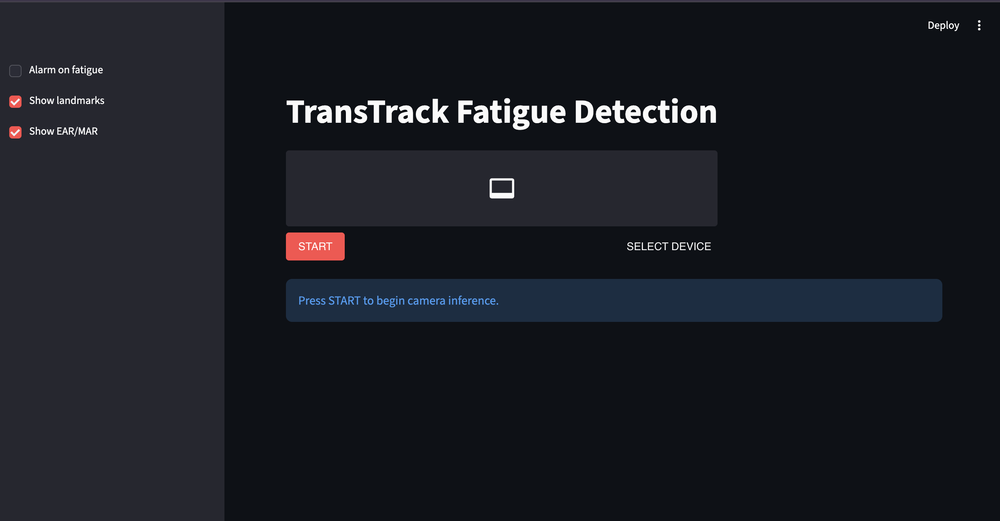
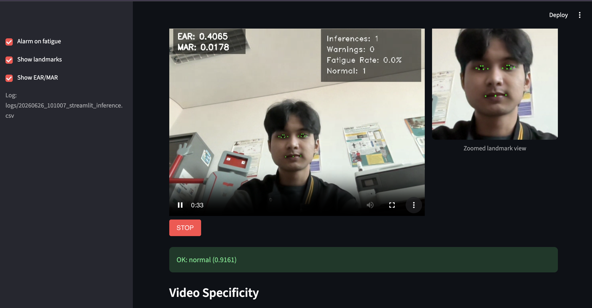
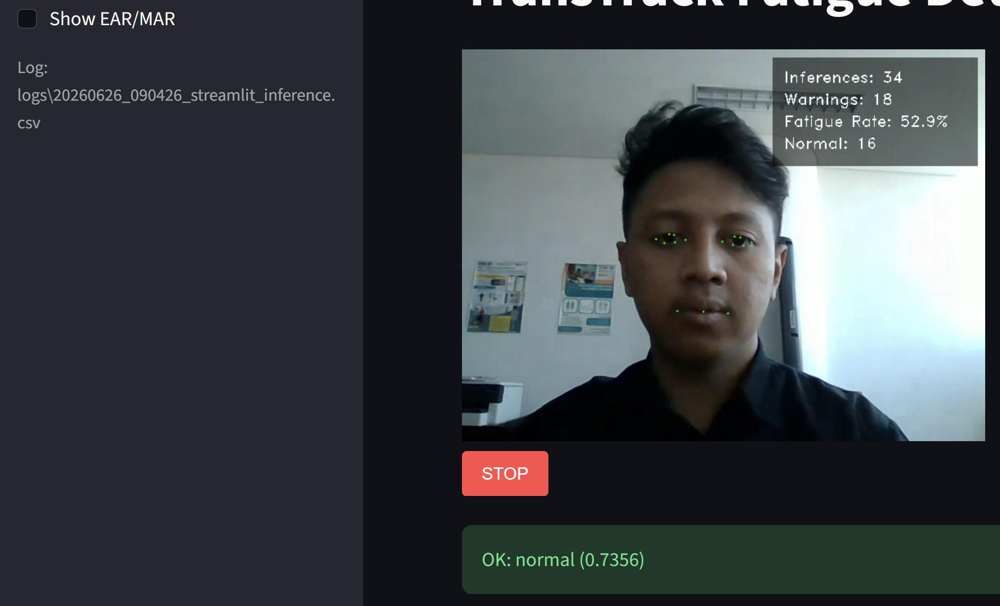
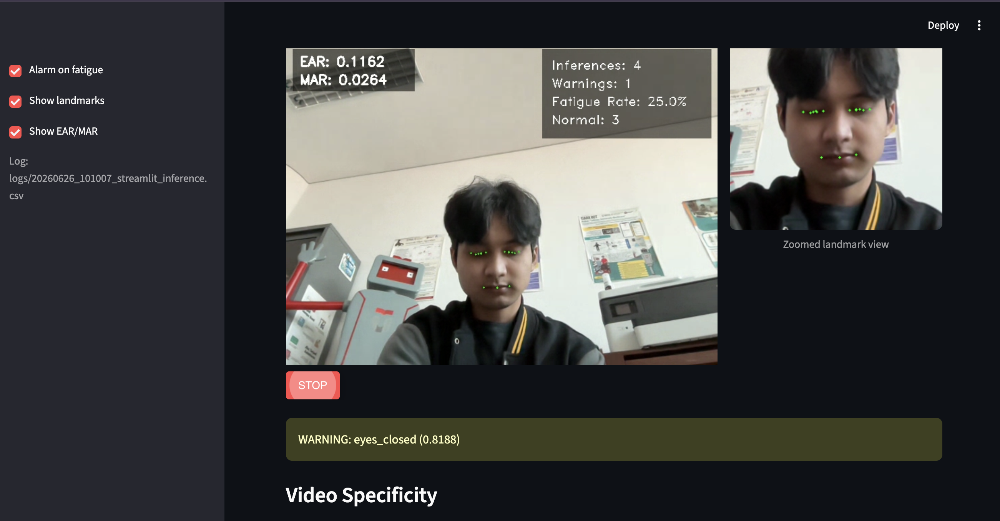
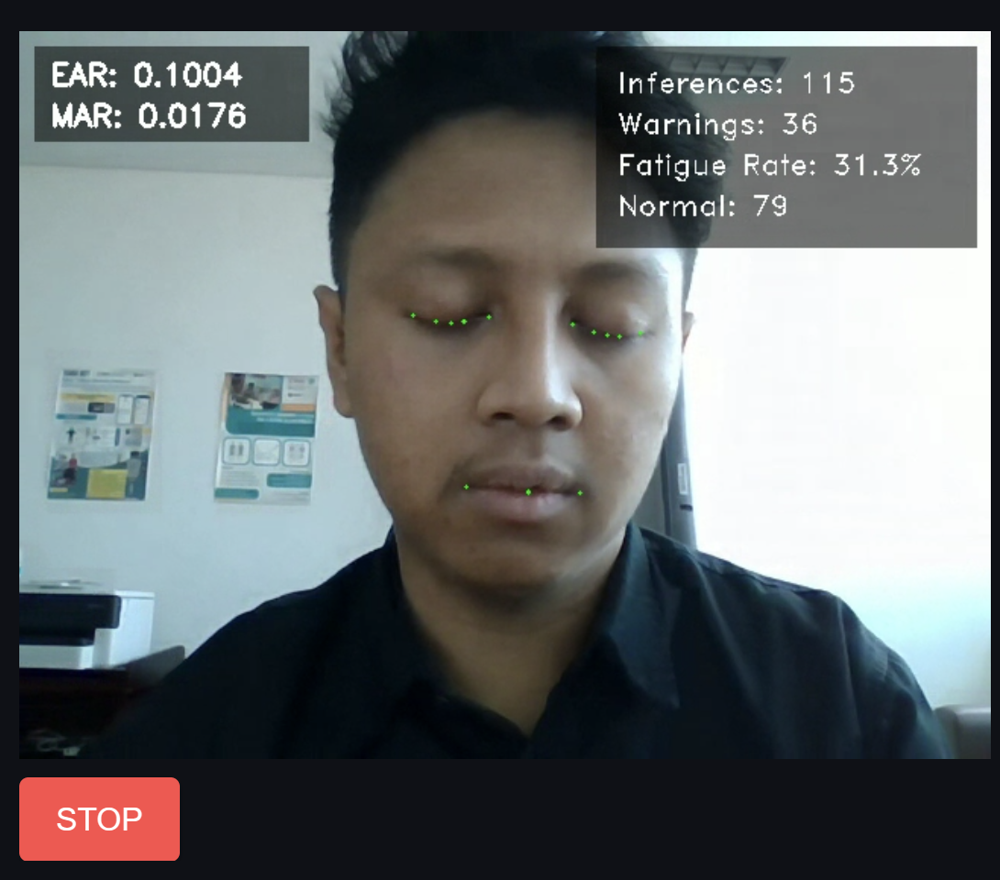
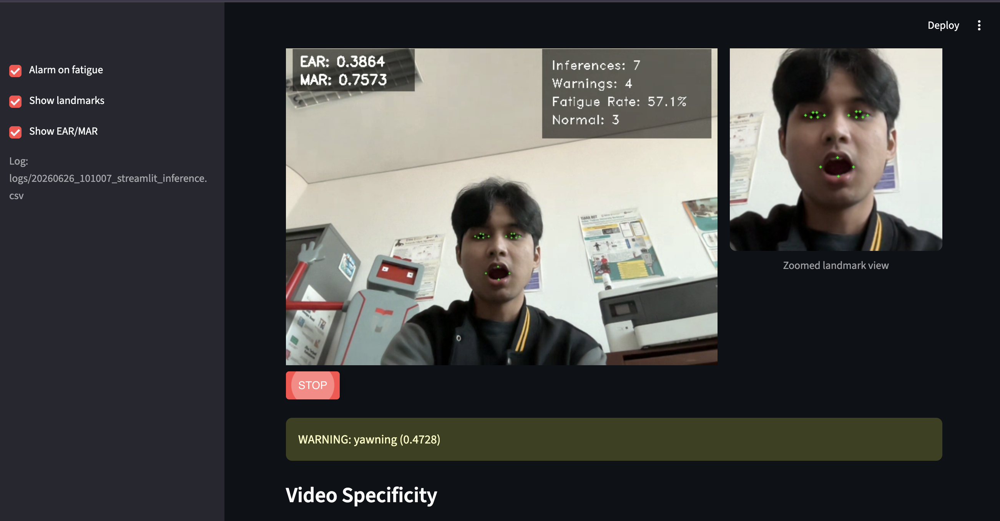
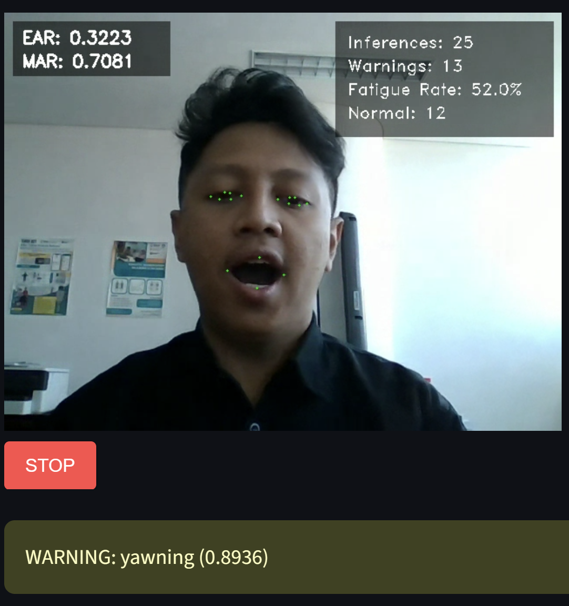
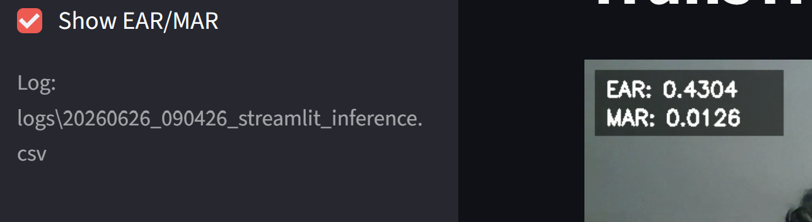
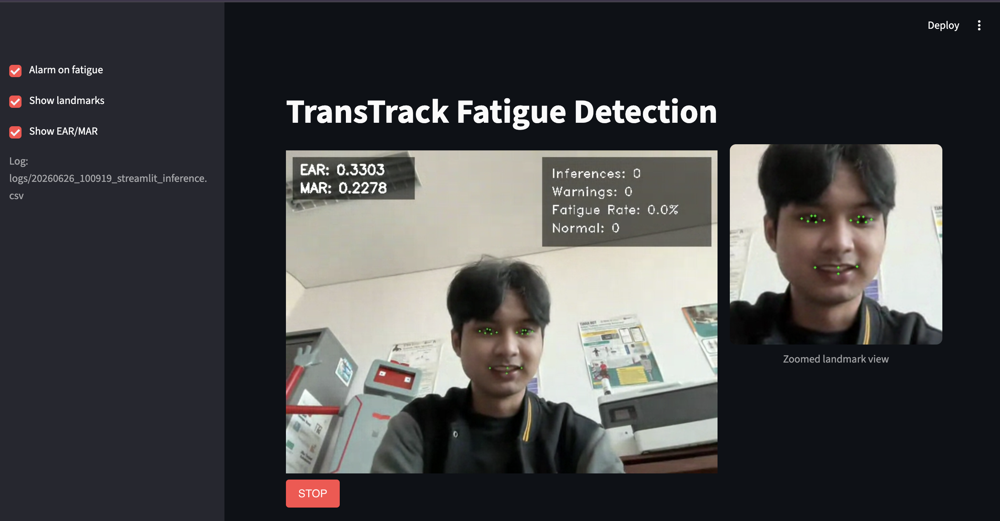

# TransTrack — Real-Time Driver Fatigue Detection

**Portfolio Project** | Rifqi Azhad | Telkom University × Bandung Techno Park  
**Industry Partner** | PT. Indo Trans Teknologi (TransTRACK)

---

## What This Project Does

TransTrack is a web-based application that watches a driver's face through a camera and automatically detects signs of fatigue in real time. When the system notices the driver closing their eyes or yawning, it immediately sounds an alarm.

The goal is to reduce traffic accidents caused by drowsy driving — a major problem in long-haul transportation.

---

## The Problem

Driver fatigue is one of the leading causes of road accidents, especially for commercial drivers on long routes. Traditional monitoring relies on the driver self-reporting tiredness, which is unreliable. TransTrack automates this by watching the driver continuously and raising an alert the moment fatigue is detected.

---

## How It Works

The system processes the camera feed in a pipeline of three stages:

```
Camera feed (browser)
       ↓
Face landmark detection (MediaPipe)
  → Eye Aspect Ratio (EAR) — how open the eyes are
  → Mouth Aspect Ratio (MAR) — how open the mouth is
  → Head pose — pitch, yaw, roll angles
       ↓
Fatigue classification (MultiScaleTCN deep learning model)
  → Looks at the last 20 seconds of data (200 frames at 10 FPS)
  → Outputs one of three labels every 10 seconds
       ↓
Result displayed in browser + alarm if fatigue detected
```

**Three possible results:**
- `normal` — driver is alert
- `eyes_closed` — driver's eyes are closed (fatigue warning)
- `yawning` — driver is yawning (fatigue warning)

If either warning label is detected, the app sounds an audio alarm immediately.

---

## The Deep Learning Model

The classifier is a **MultiScaleTCN** (Multi-Scale Temporal Convolutional Network) — a custom deep learning architecture built with PyTorch.

**Why this model:**
- Temporal data (sequences of features over time) needs a model that understands *patterns across time*, not just single frames
- Multi-scale stems capture both short-term (blink, sudden yawn) and long-term (gradual eye droop) patterns simultaneously
- Dilated residual blocks expand the receptive field without losing detail
- Squeeze-and-Excitation (SE) blocks help the model focus on the most relevant features

**Input:** 8 features × 200 timesteps (20 seconds at 10 FPS)  
**Features:** Left EAR, Right EAR, MAR, pitch, yaw, roll, nose X, nose Y  
**Output:** Probability scores for 3 classes → highest confidence wins

---

## Tech Stack

| Layer | Technology |
|---|---|
| Web UI | Streamlit |
| Camera (browser) | streamlit-webrtc (WebRTC) |
| Face detection | MediaPipe Face Landmarker |
| Deep learning | PyTorch (MultiScaleTCN) |
| Alarm | Web Audio API (via browser) |
| Deployment | Streamlit Cloud |
| Language | Python 3.11 |

---

## App Screenshots

### Idle State — Before Starting the Camera

The app opens with a clean interface. The user presses START to activate the camera and begin fatigue monitoring.



*Light mode: sidebar controls on the left, WebRTC camera widget in the center, prompt to press START.*

---



*Dark mode variant — same layout. The sidebar shows "Alarm on fatigue" unchecked, with Show landmarks and Show EAR/MAR enabled.*

---

### Camera Active — Normal State

Once START is pressed and the camera is running, the live feed appears with optional overlays. The stats panel shows inference count, warning count, and fatigue rate.



*Label: **OK: normal (0.9161)** — driver is alert. EAR: 0.4065, MAR: 0.0178. Stats show 1 inference, 0 warnings, 0% fatigue rate.*

---



*Label: **OK: normal (0.7356)** — green facial landmark dots visible on eyes and mouth. Fatigue rate 52.9% across 34 total inferences.*

---

### Fatigue Detected — Eyes Closed

When the model detects closed eyes, a yellow warning banner appears and the alarm sounds.



*Label: **WARNING: eyes_closed (0.8188)** — EAR drops to 0.1182 (very low, eyes nearly shut). 4 inferences total, 1 warning, 25% fatigue rate.*

---



*Same warning state after a longer session: 115 inferences, 36 warnings, 31.3% fatigue rate. EAR: 0.1004.*

---

### Fatigue Detected — Yawning

When a yawn is detected, the MAR value spikes (mouth wide open) and the alarm triggers.



*Label: **WARNING: yawning (0.4728)** — MAR jumps to 0.7573 (mouth wide open). 7 inferences, 4 warnings, 57.1% fatigue rate.*

---



*Label: **WARNING: yawning (0.8936)** — very high confidence yawn detection. MAR: 0.7081, 52% fatigue rate across 25 inferences.*

---

### EAR/MAR Overlay Close-Up

The app can display real-time Eye Aspect Ratio and Mouth Aspect Ratio values directly on the video frame.



*EAR: 0.4304, MAR: 0.0126 — normal open eyes, closed mouth. Values update live with each processed frame.*

---

### Live Inference (Earlier UI Version)

Earlier version of the app with the two-column layout showing a zoomed landmark view alongside the main feed.



*Original layout: main camera feed (left), zoomed face landmark region (right). EAR and MAR overlay visible on video. Stats: 0 inferences at session start.*

---

## Key Features

- **Real-time detection** — processes 10 frames per second, classifies every 10 seconds
- **Browser-based** — no app to install, works directly in Chrome
- **Alarm system** — plays 3 overlapping audio beeps at maximum volume when fatigue is detected
- **Sidebar controls** — toggle alarm, show/hide facial landmarks, show/hide EAR/MAR values
- **Session logging** — every inference is saved to a timestamped CSV file for review
- **Deployable** — live demo hosted on Streamlit Cloud

---

## What I Built

- Integrated MediaPipe face landmarking into a live WebRTC video stream
- Implemented real-time feature extraction (EAR, MAR, head pose via solvePnP)
- Built the Streamlit UI with anti-flicker fragment rendering and alarm deduplication
- Resolved WebRTC/ICE negotiation issues for reliable browser camera access
- Deployed the full app to Streamlit Cloud including the 3.6 MB MediaPipe model

---

## Live Demo

Deployed at: [transtrack-demonstration.streamlit.app](https://transtrack-demonstration.streamlit.app)

---

## Institutions


